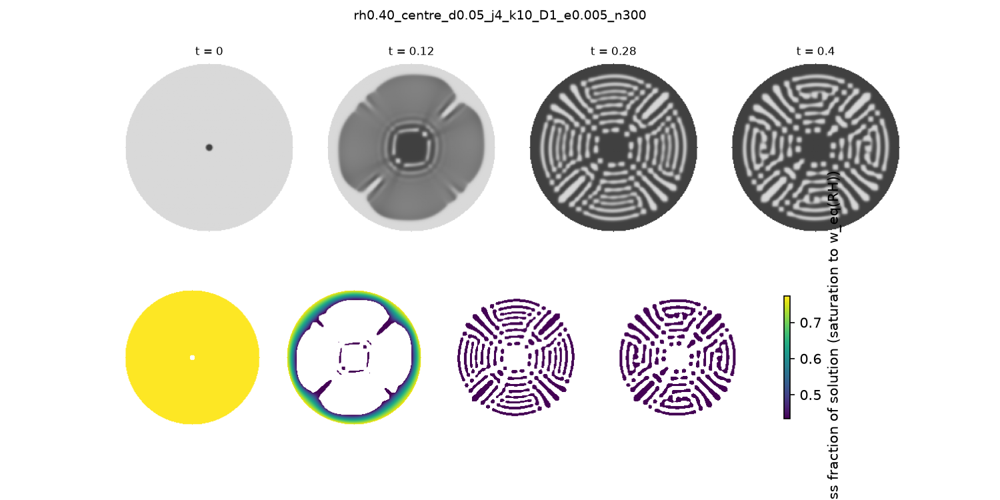

<p align="center">
  
</p>

# aiomfac_py

Pure-Python port of the **AIOMFAC** thermodynamic group-contribution model (activity coefficients of
inorganic–organic mixtures). The activity-coefficient pipeline (LR + MR + SR and the composition conversion)
runs end-to-end and is validated against the Fortran reference, including the Fortran auto-completion and dissociation-equilibrium
machinery for bisulfate, bicarbonate, and joint bisulfate+bicarbonate systems (with Ca2+/CaSO4(s) precipitation);
see "Validation status" below for what is and isn't covered. `aiomfac_py.s2as` additionally integrates the
(already-Python) S2AS tool for going straight from a SMILES string to an AIOMFAC component.
`aiomfac_py.lle` adds a liquid-liquid equilibrium (LLE) solver built *on top of* `ActivityModel` -- a
from-scratch port of the primal-dual interior-point Gibbs-energy-minimization algorithm behind the UHAERO
aerosol model (Amundson et al., 2006, *J. Optim. Theory Appl.*, 130(3), 375-407), not part of AIOMFAC-web itself
and not Fortran-validated (see `src/aiomfac_py/lle.py`'s module docstring for what is and isn't faithful to that
paper, and `tests/test_lle.py` for how the solver itself, independent of AIOMFAC, is validated).

* Reference implementation: <https://github.com/andizuend/AIOMFAC> (AIOMFAC-web v3.14, commit
  `b9cb96d0eb22dc65a5e63edafe1ed97bd07662f2`). This port is validated against that Fortran code.
* `aiomfac_py.s2as` integrates <https://github.com/andizuend/S2AS__SMILES_to_AIOMFAC> (commit
  `88a2bffde1d375f8cb86a6e47ead6c3f0dad1833`) -- SMILES -> AIOMFAC subgroups, already pure Python upstream.
* `aiomfac_py.lle` ports the algorithm of Amundson, Caboussat, He & Seinfeld (2006), *J. Optim. Theory Appl.*,
  130(3), 375-407, doi:10.1007/s10957-006-9110-z -- an independent algorithm, not part of AIOMFAC-web, so this
  part of the package is not validated against the Fortran reference above.
* Scope of the first release: activity coefficients (plus LLE on top of them). The viscosity module
  (AIOMFAC-VISC, plus its organic-inorganic mixing extension) was added afterwards; see the
  `src/aiomfac_py/viscosity.py` row below for exactly what it covers.
* `aiomfac_py.tgml_armeli` loads the trained machine-learning Tg model of Armeli, Peters and Koop (2023,
  *ACS Omega* 8, 12298-12309) from the authors' own model files -- not part of AIOMFAC-web, and not a
  reimplementation of their model; see its own module docstring (`src/aiomfac_py/tgml_armeli/__init__.py`)
  and `PROVENANCE.md` next to it for exactly what was loaded, from where, and (for `PROVENANCE.md`) how the
  vendored pickle files were migrated so a modern `scikit-learn`/`numpy` can load them directly.
* License: **GPL-3.0-or-later**, because this is a derivative work of the (GPL-3.0) Fortran code (and, for
  `aiomfac_py.s2as`, of the GPL-3.0 S2AS tool). `aiomfac_py.tgml_armeli`'s vendored model files are a
  separate case -- see its `PROVENANCE.md` for their license status, which is unstated upstream.
* If you use it, please cite the AIOMFAC publications listed at <https://aiomfac.lab.mcgill.ca/citation.html>
  (and, for `aiomfac_py.s2as`, Amaladhasan et al., 2026, <https://doi.org/10.5194/gmd-19-4601-2026>), and (as
  requested by the authors) let them know about your use.

## Main tool (`aiomfac-tool`)

`aiomfac_py.tool` is one entry point to the equilibrium solvers (combined liquid–liquid–solid `PhaseEquilibrium`,
inorganic `SLESolver`, fixed-composition `lle.solve_pep`, `gp_partition`) and to plain activity evaluations. A case
file (TOML or JSON) gives the system, feed, RH, gases, the calculation mode (`activity`, `equilibrium`, `lle`, `sle`,
`gas_particle`, `drying_path`, `deliquescence`, `efflorescence`, `stability`) and the solver options; results come
back in one format (text, JSON, CSV):

```
aiomfac-tool template equilibrium > case.toml     # example cases: examples/cases/*.toml
aiomfac-tool run case.toml -o result.json
```

```python
from aiomfac_py.tool import run
res = run("case.toml")
print(res.summary())
```

See [`docs/user_manual.md`](docs/user_manual.md) for the case format, the modes, the solver options and the result
fields.

## Layout

| Path | Purpose |
|---|---|
| `src/aiomfac_py/io.py` | input-file reader (`read_input_file`) — done, tested |
| `src/aiomfac_py/params.py`, `data/*.npz` | SR (UNIFAC) tables R, Q, ARR, BRR, CRR and subgroup tables NKTAB, GroupMW, Ioncharge — extracted from the Fortran source, bit-identical to the arrays the compiled model uses |
| `src/aiomfac_py/system.py` | SR system setup (species/group ordering, R/Q, interaction matrix) — port of `SetSystem`/`SRsystm` parts |
| `src/aiomfac_py/sr.py` | **short-range term** (`sr_terms`) — validated against Fortran |
| `src/aiomfac_py/lr.py`, `mr.py` | long-range (Debye–Hückel) and middle-range terms, MR parameter mapping (`build_mr_state`) — validated |
| `src/aiomfac_py/composition.py`, `numerics.py` | mass/mole fraction → mass fraction → ion molalities; `safe_exp` — validated |
| `src/aiomfac_py/completion.py` | auto-completion of bisulfate/bicarbonate systems (species set) — validated structurally |
| `src/aiomfac_py/dissociation.py` | HSO4- <-> H+ + SO4-- equilibrium (Brent's method, `numerics.brent_root`) — validated end-to-end, wired into `ActivityModel` |
| `src/aiomfac_py/carbonate.py` | bicarbonate-only equilibrium (`solve_carbonate`, CO2(aq)/HCO3-/CO3--/OH-/H+; differences from the Fortran code trace to a Fortran ion-sum refresh, see below) and the joint bisulfate+bicarbonate equilibrium (`solve_carb_sulf`, machine precision, plus Ca2+/CaSO4(s) precipitation) — both `scipy.optimize.root`-based, wired into `ActivityModel`; this is the carbonate/bicarbonate side of the ion extension of Yin et al. (2022, *Atmos. Chem. Phys.* 22, 973–1013) — the iodide/iodate (I-/IO3-) side of the same paper needs no dedicated module, just the existing ion subgroups and parameter tables, demonstrated in `notebooks/04_zuend2011_new_functional_groups.ipynb` |
| `src/aiomfac_py/model.py` | `ActivityModel` / `activity_coefficients()` — end-to-end for simple systems |
| `src/aiomfac_py/s2as/` | SMILES -> AIOMFAC subgroups (optional `epam.indigo` dependency) — integration of the upstream S2AS tool, validated bit-for-bit against it |
| `src/aiomfac_py/lle.py` | liquid-liquid equilibrium (`solve_pep`/`solve_pep_gfe`) — primal-dual interior-point/active-set Gibbs-energy minimization on top of `ActivityModel`, port of Amundson et al. (2006, JOTA 130); **not** part of AIOMFAC-web, not Fortran-validated (see the module docstring and `tests/test_lle.py`) |
| `src/aiomfac_py/solids.py`, `src/aiomfac_py/sle.py` | solid–liquid equilibrium (`SLESolver`) at fixed T and RH on top of `ActivityModel` — primal-dual active-set Gibbs minimization after Amundson et al. (2006, JOTA 128, 469–498), with a 23-solid database of K_sp(T) and hydrates for atmospheric salts; neutral/alkali–alkaline-earth systems only (no H+/HSO4-, no gas phase). **Not** part of AIOMFAC-web, not Fortran-validated — see the "Solid–liquid equilibrium" section and `docs/SLE_design.md` |
| `src/aiomfac_py/phase_equilibrium.py` | combined liquid–liquid–solid equilibrium (`PhaseEquilibrium`) of water + organics + ions at fixed T and RH: one transformed-Gibbs minimization over all liquid phases (ion basis, per-phase electroneutrality, water open at a_w = RH) and all candidate solids, with an outer tangent-plane stability test that adds liquid phases; equilibrium, metastable (`solids="none"`) and drying-path modes. Acid sulfate and carbonate systems (speciated in every liquid, as in SLESolver) and volatile NH3/HNO3/HCl/CO2 (open fixed-p or closed ideal-gas phase) supported. **Not** part of AIOMFAC-web, not Fortran-validated — see the "Combined liquid–liquid–solid equilibrium" section and `tests/test_phase_equilibrium.py` |
| `src/aiomfac_py/tool.py`, `examples/cases/` | main tool (`aiomfac-tool`): case files, calculation modes, solver selection, unified results; manual in `docs/user_manual.md`, tests in `tests/test_tool.py` |
| `src/aiomfac_py/gp_partition.py` | gas/particle partitioning at fixed RH (`gp_partition`) — joint Levenberg-Marquardt solver (default), a pseudo-transient RH-continuation fallback (inspired by Amundson et al., 2007, C. R. Acad. Sci.), and the original successive-substitution method, all on top of `ActivityModel`; **not** part of AIOMFAC-web (see the module docstring and `tests/test_gp_partition.py`) |
| `src/aiomfac_py/viscosity.py` | AIOMFAC-VISC (`electrolyte_viscosity`, `water_viscosity_pas`) — predictive dynamic-viscosity model for **aqueous electrolyte** solutions, port of Lilek and Zuend (2022, *Atmos. Chem. Phys.* 22, 3203–3233); built on top of `ActivityModel`'s ion molal activities/activity coefficients. Covers the 17 ions and all cation–anion pairs the paper fits. Also covers the paper's organic-inorganic mixing extension (Sect. 3): `organic_mixture_viscosity`/`pure_organic_viscosity_vtf` port the group-contribution organic-viscosity engine of Gervasi, Topping and Zuend (2020, *Atmos. Chem. Phys.* 20, 2987–3008); `aquelec_viscosity`/`aquorg_viscosity` implement two of Lilek and Zuend's three mixing rules (Sect. 3.4.1–3.4.2); and `predict_tg_derieux2018` implements the closed-form glass-transition-temperature estimate of DeRieux et al. (2018, *Atmos. Chem. Phys.* 18, 6331–6351) that the organic-viscosity model's Tg-dependent pure-component estimate relies on. Does **not** implement the ZSR mixing rule (Sect. 3.4.3, needs an iterative nonlinear solve) — see the module docstring and `tests/test_viscosity.py` |
| `src/aiomfac_py/tgml_armeli/` | `predict_tg_ml_fg`/`predict_tg_ml_smiles` — the newer, more accurate machine-learning Tg predictor of Armeli, Peters and Koop (2023, *ACS Omega* 8, 12298–12309; optional `tgml`/`tgml-smiles` dependencies). Not a reimplementation — loads the authors' own trained `scikit-learn` model files (`data/*.pkl`, from the paper's own Zenodo deposit, see `PROVENANCE.md`) directly, with no SMILES-featurization dependency on `deepchem`/`tensorflow` (confirmed unnecessary by reading `deepchem`'s own source, see `PROVENANCE.md`). Incidentally the same "TgML_Armeli" module the Fortran reference itself only ships as a separately-licensed, optional add-on (see the `smiles-based pure-component method?` note further down). Installs normally alongside the rest of this package (no separate environment needed) — the vendored pickle files were migrated (`tools/migrate_tgml_pickles.py`) so any reasonably current `scikit-learn` can load them directly, and SMILES-mode descriptors are looked up by name so any reasonably current `rdkit` works too (see `PROVENANCE.md` and the module docstring for the full story, including one small known accuracy caveat vs. the exact RDKit version A2023 trained on) |
| `tools/extract_params.py`, `tools/extract_mr_params.py` | regenerate `sr_params.npz`, `subgroup_params.npz`, `mr_params.npz` from the Fortran source (never edit tables by hand; `extract_mr_params` interprets `MRdata` statement by statement and reproduces Fortran literal kinds) |
| `fortran_patches/` | patch that makes the Fortran model dump every activity-coefficient term at full precision, plus notes on how to rebuild the references |
| `tests/reference/` | examples 0001/0003 (inputs, standard outputs, per-term dumps) |
| `tests/reference/cases/` | 9 generated validation cases, 145 points (`tools/make_cases.py` + `tools/run_fortran_cases.sh`) |
| `tests/reference/ext/` | 8 more generated cases, 106 points, targeting Qcca/Rcc, ester/ether/acid, aromatic/amine, PEG (`tools/make_cases_ext.py` + `tools/run_fortran_cases.sh`) |
| `tests/reference/completion/` | NaHSO4, NaHCO3 and H2SO4 cases: structural completion (`DIMS`) and, for the two bisulfate cases, the full dissociation-equilibrium pipeline |
| `tests/reference/carbonate/` | NaHCO3 and KHCO3 cases used to validate `carbonate.py`'s bicarbonate-only solve |
| `tests/reference/carb_sulf/` | NaHSO4+NaHCO3 (`c005`) and Ca(IO3)2+NaHSO4+NaHCO3 (`c006`) cases used to validate `carbonate.py`'s joint `solve_carb_sulf` and the Ca2+/CaSO4(s) precipitation step |
| `tests/reference/s2as/` | upstream S2AS's own 3 example SMILES lists (7, 174, and 2823 molecules) and their generated AIOMFAC input files, used to validate `s2as/` bit-for-bit |
| `fortran_patches/SubModDissociationEquil_carb_debug.f90` | throwaway-instrumented copy used once to dump Fortran's internal dissociation constants/converged molar amounts directly, for the per-species precision analysis above (not needed to use or test the package) |

## Conventions

* 0-based arrays; subgroup `s` ↔ index `s-1`, main group `g` ↔ index `g-1`; `ARR[i, j]` = Fortran `ARR(i+1, j+1)`.
* Species order (as in Fortran `X`): neutrals (input order), cations, anions.
* Composition tables: columns `cp02…cpNN` hold components 2..N; component 1 is `1 − Σ others`.

## Development

```
pip install -e .[test]
pytest
```
`test_port_matches_fortran` is a strict `xfail` today; when the port works it will start passing,
which pytest reports as a failure until the marker is removed — that is the signal to promote it to a real test.

## 🚀 Colab Quick Start (1 Cell)

`aiomfac_py` has no compiled dependencies of its own — pure Python + numpy, with two small optional extras
(`scipy` for the dissociation-equilibrium solvers, `epam.indigo` for the SMILES tool) — so, unlike
[SeoulTechPSE/fenicsx-colab](https://github.com/SeoulTechPSE/fenicsx-colab), there's no conda/micromamba
environment and no Jupyter cell magic here: a single `pip install` does it.

Open a new Google Colab notebook and run **this single cell**:

```python
# aiomfac_py on Google Colab
# SeoulTechPSE/aiomfac-python

from pathlib import Path
import subprocess

REPO_URL = "https://github.com/SeoulTechPSE/aiomfac-python.git"
REPO_DIR = Path("/content/aiomfac-python")

if not REPO_DIR.exists():
    print("Cloning aiomfac-python...")
    subprocess.run(["git", "clone", REPO_URL, str(REPO_DIR)], check=True)
else:
    print("Repository already exists — pulling latest...")
    subprocess.run(["git", "-C", str(REPO_DIR), "pull", "--ff-only"], check=True)

INSTALL_SMILES = False  # <-- set True to also install epam.indigo (aiomfac_py.s2as)
USE_CLEAN = False       # <-- set True to force a clean reinstall

opts = ["--carbonate"]
if INSTALL_SMILES:
    opts.append("--smiles")
if USE_CLEAN:
    opts.append("--clean")

get_ipython().run_line_magic("run", f"{REPO_DIR / 'setup_aiomfac.py'} {' '.join(opts)}")
```

After this finishes, `import aiomfac_py` works directly (installed editable, so files under `src/` can also be
edited and re-imported in the same Colab session without reinstalling).

See [`notebooks/bootstrap_colab.ipynb`](notebooks/bootstrap_colab.ipynb) for the same steps as a ready-to-run
notebook, [`notebooks/01_quickstart.ipynb`](notebooks/01_quickstart.ipynb) for four worked examples: reading
an AIOMFAC-web input file, building a mixture by hand (aqueous NaCl), the joint bisulfate+bicarbonate
dissociation equilibrium (with and without Ca2+ precipitation), and SMILES → AIOMFAC subgroups via
`aiomfac_py.s2as`; [`notebooks/02_reproduce_zuend2008.ipynb`](notebooks/02_reproduce_zuend2008.ipynb),
which reproduces (in style, not as a pixel-exact overlay) the activity-coefficient figures of the first
AIOMFAC journal paper, Zuend et al. (2008, *Atmos. Chem. Phys.*, doi:10.5194/acp-8-4559-2008) — binary and
quaternary electrolyte solutions, H2SO4/(NH4)2SO4 bisulfate dissociation, polyol+ammonium-sulfate ternaries,
salt+alcohol mean activity coefficients, and (using the new `aiomfac_py.lle` module) Fig. 9's NaCl-induced
liquid-liquid phase splitting; [`notebooks/03_zuend2010_lle.ipynb`](notebooks/03_zuend2010_lle.ipynb), which
reproduces Zuend et al. (2010, *Atmos. Chem. Phys.*, doi:10.5194/acp-10-7795-2010) — LLE phase diagrams and
stability maps (`aiomfac_py.lle`, `aiomfac_py.spinodal`) and RH-dependent gas/particle partitioning of a
six-component system (`aiomfac_py.gp_partition`, including a joint Levenberg-Marquardt solver that resolves a
genuine convergence failure of plain successive substitution for that system); and
[`notebooks/04_zuend2011_new_functional_groups.ipynb`](notebooks/04_zuend2011_new_functional_groups.ipynb),
which reproduces exemplary new-system calculations from the extended-parameterization paper, Zuend et al.
(2011, *Atmos. Chem. Phys.*, doi:10.5194/acp-11-9155-2011) — water activities of water + dicarboxylic acid +
(NH4)2SO4 systems (oxalic, malonic, succinic, glutaric acids), validated against the paper's own Appendix A2
measurements, demonstrating the new carboxyl functional group these systems require — plus a second section
reproducing new-ion systems (binary NaIO3/KIO3/HIO3, and NaI + dicarboxylic acid mixtures) from a later
extension paper, Yin et al. (2022, *Atmos. Chem. Phys.*, doi:10.5194/acp-22-973-2022), which adds the I-, IO3-,
HCO3-, CO3--, OH-, and CO2(aq) species (the carbonate/bicarbonate side of this extension was already covered by
`aiomfac_py.carbonate`; this section exercises the new iodide/iodate ion-organic interactions specifically);
and
[`notebooks/05_lilek_zuend2022_viscosity.ipynb`](notebooks/05_lilek_zuend2022_viscosity.ipynb), which uses the
`aiomfac_py.viscosity` module (AIOMFAC-VISC) to reproduce Fig. 4 of Lilek and Zuend (2022, *Atmos. Chem.
Phys.*, doi:10.5194/acp-22-3203-2022) — predicted viscosity vs. water mass fraction/activity for seven binary
aqueous chloride salts/acids (KCl, NaCl, LiCl, NH4Cl, MgCl2, HCl, CaCl2), reproducing the paper's
structure-breaking (K+, NH4+) vs. structure-making (Li+, Mg2+, Ca2+, H+) qualitative distinction, and then
extends into the paper's organic-inorganic mixing extension (Sect. 3): the organic-mixture viscosity engine
of Gervasi, Topping and Zuend (2020, *Atmos. Chem. Phys.*, doi:10.5194/acp-20-2987-2020) validated directly
against real CRC Handbook water+glycerol viscosity data (within 0.06 log10 units since the Eq. 5 fix described
under "Validation status"; the notebook's stored outputs predate that fix), the `aquelec`/`aquorg` mixing
rules demonstrated on a water+glycerol+NaCl ternary, and `predict_tg_derieux2018` (DeRieux et al., 2018,
*Atmos. Chem. Phys.*, doi:10.5194/acp-18-6331-2018) validated against that paper's own stachyose worked
example and shown, for glycerol, how much uncertainty a *predicted* (vs. measured) pure-component viscosity
adds to the mixture curve.

### Manual / local install

```
pip install "aiomfac_py[carbonate] @ git+https://github.com/SeoulTechPSE/aiomfac-python.git"
# or, from a local checkout:
python setup_aiomfac.py --carbonate          # see --help for --smiles / --all / --clean / --no-editable
```

## Usage

```python
from aiomfac_py import read_input_file, ActivityModel
case = read_input_file("tests/reference/inputs/input_0001.txt")
model = ActivityModel(case.components)
res = model.evaluate(case.fractions[0], case.T_K[0], case.basis)
res.gamma_neutral, res.ln_gamma          # activity coefficients / ln(gamma) of all species (neutrals, cations, anions)
```

Going straight from SMILES (requires the optional `epam.indigo` dependency: `pip install aiomfac_py[smiles]`):

```python
from aiomfac_py import ActivityModel
from aiomfac_py.s2as import smiles_to_components

result = smiles_to_components(["CCCCO"])         # 1-butanol; water is prepended automatically
model = ActivityModel(result.components)
res = model.evaluate([0.9, 0.1], 298.15, "mass")  # 90/10 mass-fraction water/butanol
```

Predicting Tg with the machine-learning model of Armeli, Peters and Koop (2023) -- install the `tgml`/
`tgml-smiles` extras normally, alongside the rest of this package:

```
pip install -e ".[tgml,tgml-smiles]"
```

```python
from aiomfac_py.tgml_armeli import predict_tg_ml_fg, predict_tg_ml_smiles

# Functional Group Mode: ethanol (CH3=1, CH2=1, OH=1, O:C=0.5, M=46.07 g/mol), no rdkit needed
predict_tg_ml_fg(1, 1, 0, 0, 1, 0, 0, 0, o_to_c=0.5, molar_mass_g_mol=46.07)   # TgMLResult(tg_K=..., ...)

# SMILES Mode (needs rdkit as well -- see module docstring for a small accuracy caveat vs. the exact RDKit
# version A2023 trained on, if you need byte-exact reproduction of their own reported numbers)
predict_tg_ml_smiles("CCO", Tm_K=159.0)
```

## Solid–liquid equilibrium (SLE)

`aiomfac_py.SLESolver` finds the equilibrium solid assemblage, aqueous composition and water content of an
electrolyte feed at fixed temperature and relative humidity, using AIOMFAC activities (aqueous phase) and a
database of solubility products K(T) with hydrates (`aiomfac_py.SOLIDS`, 23 solids: halite, sylvite, NH4Cl,
NaNO3, KNO3, NH4NO3, (NH4)2SO4, thenardite/mirabilite, arcanite, Mg/Ca chlorides, sulfates and nitrates and
their hydrates, gypsum/anhydrite, glauberite, syngenite). The algorithm follows the primal-dual active-set
method of Amundson, Caboussat, He, Seinfeld and Yoo (2006, *J. Optim. Theory Appl.* 128, 469–498) on the
reduced (extent-of-dissolution) problem, with a linear-programming + tangent-plane-distance test for the
dry (no aqueous phase) state and an RH-continuation fallback because AIOMFAC activities are not guaranteed
convex. Requires `scipy` (`pip install aiomfac_py[sle]`).

Acid sulfates (H+ together with SO4--) are supported for the NH4+/H+/SO4-- system (also mixed with Na+, K+, Mg++,
Ca++): H+ and SO4-- are carried as *stoichiometric totals* and the HSO4- <-> H+ + SO4-- equilibrium (the Knopf et
al. 2003 constant of `aiomfac_py.dissociation`) is solved inside every activity evaluation, so the solver itself is
unchanged. The acid solids NH4HSO4, letovicite (NH4)3H(SO4)2, NaHSO4, NaHSO4·H2O, Na3H(SO4)2 and NaH3(SO4)2·H2O are in
the solid database with the thermodynamic constants of Clegg et al. (1998, J. Phys. Chem. A 102:2137, 2155), converted
from mole fraction/free ions to molality (data quality B; NH4 acid solids with the published ΔH, ΔCp, the Na acid solids
298 K only; NaH3(SO4)2·H2O is quality C, "tentative" in the paper). They are not fitted to DRH data: the pure-salt DRH
they imply with AIOMFAC (`tools/calibrate_acid_solids.py`: NH4HSO4 37.9 %, letovicite 70.1 % vs. literature ~40 / 69.5 %)
is an independent check. Feeds at exactly a double-salt stoichiometry are degenerate (Gibbs phase rule) and may be slow. Feeds may use
`"H2SO4"`, `"NH4HSO4"`, `"(NH4)3H(SO4)2"` in `feed_from_salts` or `"HSO4-"` as an ion.

```python
from aiomfac_py import SLESolver, feed_from_salts
sol = SLESolver(["Na+", "NH4+", "Cl-", "SO4--"])
feed = feed_from_salts({"NaCl": 1.0, "(NH4)2SO4": 1.0})        # mol
r = sol.solve(feed, 298.15, 0.70)                              # T / K, RH (0-1)
print(r.status, r.solids, r.water_kg)                          # e.g. solid+aqueous {...} ...
sol.scan_rh(feed, 298.15, [0.5, 0.6, 0.7, 0.8])                # warm-started RH scan
sol.deliquescence_rh(feed, 298.15); sol.efflorescence_rh(feed, 298.15, ln_s_crit=3.0)
```

K(T) modes (`mode=`): `"fitted"` (default where available; ln K fitted to solubility data *under AIOMFAC*,
so it absorbs AIOMFAC's γ(T) error along the saturation line), `"anchored"` (literature T-dependence plus a
298 K offset to AIOMFAC) and `"thermo"` (pure thermodynamic K). Efflorescence is kinetic, so
`efflorescence_rh` takes a user-supplied critical supersaturation ln S (`implied_ln_s_crit` inverts it from a
literature ERH).

Gas phase (NH3, HNO3, HCl): the volatile species are extra columns of the same active-set problem
(`aiomfac_py.gases`: Henry constants of Clegg et al. 1998; HCl T-dependence from NBS enthalpies). Two modes:
`solver.solve(feed, T, rh, p_gas={"HNO3": 1e-9, "NH3": 5e-9})` puts the particle in contact with a gas reservoir of
fixed partial pressures (atm), and `solver.solve_closed(feed, {"HNO3": 2e-6, "NH3": 3e-6}, T, rh, n_air=41.0)` conserves
the totals in a closed volume of ideal gas + air (mol), returning `result.gas`, `result.p_gas` and the condensed phases
(aqueous, or solids + gas such as NH4NO3(s) with p(NH3) p(HNO3) = Kp). Verified against the Clegg Kp(NH4NO3).
Fixed-p mode fails (reported) when the reservoir is supersaturated with respect to a solid.

Carbonate and CO2: CO3-- (total carbon) and H+ (signed proton excess) are components; HCO3-/OH- are speciated internally
with the AIOMFAC carbonate constants (checked against the Fortran-port solver), 14 carbonate/hydroxide solids are in the
DB (thermonatrite, Na2CO3, NaOH values are unverified NBS recollections, quality C), and `"CO2"` is a gas key
(`p_gas={"CO2": 4.2e-4}`). Water consumption and CO2(aq) mole fraction are neglected (Gibbs-Duhem ~1e-3).

Verification (see `tests/test_sle.py`, `tests/test_sle_acid.py` and `notebooks/06_sle_solver.ipynb`): single-salt DRH at 298 K
within ~1.6 percentage points of literature, fitted solubilities within 4 % of handbook values, the
mirabilite/thenardite transition near 305.5 K, and 100 random mixtures agreeing with a brute-force SLSQP
global Gibbs minimization. **Limitations:** gas-phase partitioning (NH3, HNO3, HCl), acid solids other than
KHSO4, H2SO4 hydrates, other double salts and NH4NO3 solid
phase transitions are not implemented; gases other than NH3/HNO3/HCl/CO2 (and organics) are not coupled; fits are valid for roughly
0–60 °C only (Na acid solids: 298 K only); solids with data-quality flag C (NaH3(SO4)2·H2O,
MgCl2·4H2O/2H2O, Mg(NO3)2·6H2O, CaCl2·6H2O, Ca(NO3)2·4H2O) are estimates; the dry-state test can take several
seconds for many-ion feeds (up to ~10 s with acid speciation). Full design, data sources and roadmap: `docs/SLE_design.md`.

## Combined liquid–liquid–solid equilibrium

`aiomfac_py.PhaseEquilibrium` computes the phase state of an organic–inorganic mixture at fixed T and RH: how many
liquid phases form, their compositions (water, organics and individual ions), and which salts crystallize. Water is an
open component (a_w = RH in every liquid). All liquid phases and all candidate solids are optimized together in one
Gibbs-energy minimization (log-barrier Newton method on the linear mass-balance and electroneutrality constraints), so
salt precipitation and the liquid–liquid split adjust to each other; an outer tangent-plane-distance test from several
trial compositions decides whether another liquid phase is needed. Every result reports its own equilibrium checks
(a_w − RH, potential differences between liquids, saturation indices, charge and mass balance).

```python
from aiomfac_py import Component, PhaseEquilibrium, implied_ln_s_crit
pinic = Component(2, "pinic_acid", ((1, 2), (2, 2), (3, 2), (4, 1), (137, 2)))
pe = PhaseEquilibrium([pinic], ["NH4+", "SO4--", "NO3-"], T_K=298.15)
feed = {"pinic_acid": 0.006, "NH4+": 0.0146, "SO4--": 0.0059, "NO3-": 0.0028}     # mol (water is set by RH)
print(pe.solve(feed, rh=0.6).summary())                          # equilibrium: solids allowed
print(pe.solve(feed, rh=0.6, solids="none").summary())           # metastable: crystallization suppressed
path = pe.drying_path(feed, [0.8, 0.6, 0.4, 0.3, 0.2],
                      ln_s_crit={"ammonium_sulfate": implied_ln_s_crit("ammonium_sulfate", 298.15, 0.35)})
```

Verification (`tests/test_phase_equilibrium.py`): the ion-basis activities equal `ActivityModel.evaluate` and satisfy
the Gibbs–Duhem relation; without organics the results equal `SLESolver` (water content, molalities, solids, including
a solid + aqueous case); without solids the liquid–liquid split of pinic acid + ammonium sulfate equals the split found
with `aiomfac_py.lle` at the same water activity and lowers the same Gibbs function. At lower RH the stability test finds
splits that `solve_pep`'s multi-start initialization misses (for example at RH 0.30 the one-phase state has TPD < −0.7
and the split lowers the Gibbs function by 0.6 in `AiomfacGFE` units). Acid sulfate systems are handled as in `SLESolver`: pass the stoichiometric ions
H+ and SO4-- (never HSO4-); the bisulfate equilibrium is solved inside every activity evaluation of every liquid, and the
acid solids (NH4HSO4, letovicite, NaHSO4, ...) are candidates. In the acid inorganic limit the results equal `SLESolver`
(including letovicite precipitation and the all-solid "dry" state).

Other activity models can be plugged in through `PhaseEquilibrium(..., liquid_model=...)`. In particular
`aiomfac_py.gibbs_model.GibbsLiquidModel` (optional `jax`) takes any JAX function g(n) = G/RT of a liquid — e.g. an
excess-Gibbs-energy neural-network surrogate of AIOMFAC — and uses ln a = ∇g with the exact Hessian ∇²g, both
jit-compiled once and reused for every call, phase, RH and temperature (forward-over-reverse Hessian; a Hessian-vector
product is available for matrix-free use). See `docs/phase_equilibrium.md`, Sect. 3.5.

Carbonate systems follow `SLESolver` as well: pass CO3-- (total carbonate) and H+ (the sign-free proton excess,
negative for basic solutions); CO2(aq)/HCO3-/CO3--/OH- are speciated in every liquid, and carbonate and hydroxide
solids are candidates. Volatile NH3, HNO3, HCl and CO2 (constants of `aiomfac_py.gases`) can be exchanged with an open
reservoir (`solve(..., p_gas={"HCl": 1e-9})`, net transfer in `result.gas`) or with a closed ideal gas phase of `n_air`
mol of air (`solve(..., gas_total={"HNO3": 2e-5, "HCl": 0.0}, n_air=41.0)`). In the inorganic limit open and closed gas
solutions and carbonate solutions equal `SLESolver`, e.g. chloride depletion of NaCl by HNO3. Species absent from the
feed that no gas can supply are removed from the problem automatically. **Limitations:** with organics, AIOMFAC's
carbonate treatment (CO2(aq) with its own salting-out activity coefficient) makes the speciated potentials only
approximately consistent (Gibbs-Duhem residual up to about 1 %); the solver then relies on the equilibrium checks. When
a volatile species evaporates almost completely (e.g. p(HCl) = 1e-12 atm), the remaining trace may fail the checks;
use a realistic partial pressure (about 1e-9 atm).

## Validation status (what is and is not verified)

Verified against the instrumented Fortran model (AIOMFAC-web v3.14, commit above), full pipeline
(mass/mole fractions -> molalities -> X -> LR -> MR -> SR -> ln gamma -> activities), scaled difference < 1e-12
unless noted:

* **Examples 0001 / 0003** (shipped with the Fortran repo): water + 4 organics + NaCl (12 points, 280-302 K) and a
  carbonate system (1 point; only water and the ions are checked, see below). Neutral gamma also match the values
  printed by the *unmodified* Fortran output routine (6 significant digits).
* **9 generated cases, 145 points** (`tools/make_cases.py`, references regenerated with `tools/run_fortran_cases.sh`):
  NaCl from dilute to near-saturation; CaCl2, MgCl2 (divalent cations); LiCl (high ionic strength); NaCl+KBr (adds the
  cross-combinations NaBr/KCl that are not in the input -- exercises the automatic electrolyte-component completion
  in `build_mixture`); water+ethanol+NaCl with organic and salt varied independently; 4 organics + CaCl2 over a
  275-325 K sweep; a random 6-component mixture with 4 cations / 2 anions (8 electrolyte components, exercises
  cross-ion combinations at once); and dilute/zero-abundance edge points. Together with examples 0001/0003 this
  covers ionic strength from about 1e-6 to > 8 mol/kg and temperatures 275-325 K. Every point also matches the
  *unmodified* Fortran output (6 digits), and all Fortran reference runs finished with error indicator 0 (the only
  non-zero per-point flag anywhere is warning 10, "temperature outside the recommended electrolyte range", expected
  for the two temperature sweeps).
* Parameter tables (SR, subgroup, MR) are bit-identical to the arrays the compiled Fortran model uses.
* **8 more generated cases, 106 points** (`tools/make_cases_ext.py`, references regenerated the same way):
  targeted coverage for gaps identified below. `cc01` (NH4HSO4, 18 points) activates the `Qcca`/`Rcc`
  three-ion interaction terms (confirmed directly: `model._mr.QccaInteract`/`RccInteract` are both `True`, and
  NH4+/H+/HSO4- are all simultaneously present after dissociation) and matches Fortran to the same machine
  precision as every other case. `cc02`/`cc03`/`cc04` (ethyl acetate / dimethyl ether / acetic acid, each +
  NaCl, 10 points) cover the ester (CH3COO), ether (CH3O) and carboxylic-acid (COOH) main groups. `cc05`/`cc06`
  (toluene / methylamine + water, no salt, 16 points each) cover the aromatic-ring and amine main groups --
  electrolyte-free by necessity, since AIOMFAC's MR tables have no main-group<->ion parameters for either
  (Fortran errorflagmix 1; confirmed by the Python port raising the same error for e.g. toluene+NaCl, see
  `test_aromatic_and_amine_main_groups_have_no_electrolyte_mr_parameters`) -- a real limit of the
  parameterization, not a porting gap. `cc07`/`cc08` (PEG oligomer alone, and with (NH4)2SO4, 16 / 10 points)
  cover the PEG subgroup 154 special-case parameters described below. These inputs all set
  `smiles-based pure-component method? 0` (armeliON = `.false.`) so the Fortran run skips the separately-licensed
  TgML_Armeli viscosity/Tg lookup, which is irrelevant to activity coefficients and not installed here (verified:
  byte-identical `debug_terms.txt` with/without it on an existing case).

For **example 0003** specifically: LR and MR of water and of all ions agree to 1e-12 when fed the Fortran molalities
(CO2(aq) is excluded: the Fortran `GammaCO2()` overwrites its LR/MR/SR terms afterwards, not ported).

**Limits of that evidence -- please read before trusting results:**

* No very high ionic strength against Fortran: the `omega*sqrt(I) > 300` and `sqrt(I) > 250` guard branches in
  `mr.py` guard against sqrt(ionic strength) upward of ~250-375 mol/kg -- unreachable by any real electrolyte
  solution (saturated CaCl2/LiCl, the most concentrated cases here, sit around sqrt(I) ~ 4-6) and not
  constructible as an AIOMFAC-web input file, so there is no way to generate a Fortran comparison point either.
  `tests/test_mr_high_ionic_strength.py` calls `mr_terms` directly with a synthetic, deliberately out-of-range
  `si` to confirm the branches execute and return finite output, but "matches Fortran" isn't a meaningful claim
  to make about them.
* **Bisulfate systems** (HSO4- present, or H+ + SO4-- given directly, *without* any HCO3-/CO3--) are now handled
  automatically end-to-end: `ActivityModel` completes the component list with `completion.py` if needed, then
  solves the HSO4- <-> H+ + SO4-- equilibrium (`dissociation.py`, a 1-D root-find with a self-contained Brent's
  method, port of Fortran `HSO4_dissociation`/`DiffKsulfuricDissoc`). Validated against two Fortran cases (NaHSO4;
  H2SO4 given as one H+/SO4-- component) at several concentrations each: equilibrium ion molalities and total
  ln(gamma) of every species agree to atol 1e-12 to 1e-13. Coverage is narrow -- two salts, one temperature
  (298.15 K), no mixed sulfate/other-electrolyte systems, no very high or very low ionic strength -- and the
  root-finder itself is a plain bracket-and-bisect-then-Brent search, not the Fortran solver's guided initial
  guess, so behaviour at pathological edges (near-zero or near-saturation sulfate) is unverified.
* **Bicarbonate-only systems** (HCO3-/CO3--, no sulfate) are now handled automatically too: `ActivityModel`
  completes the system, then solves the 5-unknown equilibrium (CO2(aq) + H2O <-> H+ + HCO3-, HCO3- <-> H+ + CO3--,
  H2O <-> H+ + OH-, plus two mass balances) with `scipy.optimize.root(method="hybr")` -- SciPy's own MINPACK
  `hybrd` wrapper, the same algorithm Fortran uses, rather than a hand-written solver. `GammaCO2` (which overwrites
  CO2(aq)'s own ln(gamma) with a salting-out-coefficient sum) is ported and applied automatically.
  Validated against two Fortran cases (NaHCO3, KHCO3; 2 points each) by instrumenting the Fortran source to dump
  its converged molar amounts. The port agrees with the reference Fortran code (andizuend/AIOMFAC b9cb96d) to
  ~1e-6 for HCO3- and to ~3e-4 for the trace ion H+, and in systems where the speciation changes the number of ion
  moles strongly (e.g. H2CO3 given as H+/CO3--) the water activity differs by up to 0.06. **The cause is in the
  Fortran code, not in this port** (an earlier version of this note blamed catastrophic cancellation in the mass
  balance; that explanation was wrong). In `Gammas()` (ModCalcActCoeff.f90) the sum of ion molalities used for the
  mole fractions is refreshed only `if (bisulfsyst)`, although the comment there says it changes in both the
  sulfuric and the carbonate dissociation; in a bicarbonate-only system it therefore keeps the value from before
  the speciation, the mole fractions no longer sum to one, and x_water (hence a_w) and the short-range terms are
  evaluated at a stale composition. With that line changed to `if (bisulfsyst .or. bicarbsyst)`, the Fortran
  results agree with this port to the printed digits (a_w and all ion molalities to ~1e-7 relative, including
  H+), and for the 84 bicarbonate-only compositions of the surrogate cost benchmark the largest water-activity
  difference falls from 0.057 to 5e-9. This port follows the corrected (self-consistent) behaviour; the
  reference tests below compare with the unpatched Fortran dumps at the tolerances that the discrepancy requires.
  Requires the optional `scipy` dependency (`pip install aiomfac_py[carbonate]`); `ActivityModel` raises
  `ImportError` from within `carbonate.solve_carbonate` if it is used without scipy installed.
* **Bisulfate + bicarbonate systems together** (both HSO4-/SO4-- and HCO3-/CO3--) are now handled automatically
  too: `ActivityModel` solves the joint 6-unknown equilibrium (`carbonate.solve_carb_sulf`, port of Fortran
  `HSO4_and_HCO3_dissociation` with `bisulfsyst == True`) -- the same three bicarbonate equilibria as above plus
  HSO4- <-> H+ + SO4--, all coupled through the shared H+ pool. If Ca2+ is also present, the deterministic
  Ca2+ + SO4-- -> CaSO4(s) precipitation pre-step (`_precipitate_ca_sulfate`, Fortran's `idCa > 0` branch -- a
  full stoichiometric removal down to a tiny bookkeeping residual, *not* a Ksp-based solubility equilibrium; the
  original Fortran routine doesn't model one either) runs first.

  Validated against two Fortran cases instrumented the same way as the bicarbonate-only solver above: `c005`
  (Water + NaHSO4 + NaHCO3, no Ca2+, 10 points across dilute/concentrated/trace-species compositions and three
  temperatures) and `c006` (Water + Ca(IO3)2 + NaHSO4 + NaHCO3, 6 points, exercising the precipitation step; the
  divalent anion component uses AIOMFAC subgroup 246, IO3-, not Cl- -- an earlier draft of this case mislabeled it
  "CaCl2"; the underlying Ca2+/CaSO4(s) precipitation math is anion-independent, so this was a labeling error only,
  not a validation error).
  Agreement is **machine precision (~1e-14 to 1e-15) at every point where Fortran's own solver converges** --
  markedly *better* than the bicarbonate-only case, because here H+ is pinned by two independent equilibria
  (bisulfate and bicarbonate) rather than one, which sidesteps the catastrophic-cancellation conditioning issue
  documented above.

  One edge case is worth calling out explicitly: when Ca2+ is present in *large excess* of the total sulfate pool,
  Fortran's precipitation step consumes essentially all of the sulfate, leaving a residual SO4-- pool pinned at a
  ~1e-13 mol bookkeeping floor (`min(1e-5*nSulfmax, 1e3*deps)` -- for any normal-sized system this evaluates to
  the `deps`-scaled term, not the `nSulfmax`-scaled one). Solving the coupled 6-unknown system with this one
  equation living ~13 orders of magnitude below the other five is numerically degenerate -- and this was verified
  to be a limitation of Fortran's own `hybrd` solve, not an artifact of this port: instrumenting the two
  problematic input points directly showed MINPACK returning `info == 4` ("iteration is not making good
  progress") with `sum(|diffK|) ~ 38` instead of ~1e-13, i.e. Fortran's own reported output for these inputs is
  not a converged, trustworthy equilibrium either. In that regime, this port decouples the negligible sulfate
  equilibrium (fixing HSO4- ~ 0, since a pool this small dissociates essentially completely) and solves the
  remaining bicarbonate system with the already-validated `solve_carbonate`, giving a well-converged,
  mass-balanced answer of its own rather than attempting to reproduce Fortran's non-convergent one. This
  decoupling is not expected to -- and, by construction, does not -- bit-match Fortran's unreliable output for
  such inputs; `tests/test_carb_sulf.py` documents and tests this explicitly rather than silently working around
  it.
* **PEG systems (subgroup 154, "CH2OCH2[PEG]") are now ported**: `system.py` overrides R/Q of subgroup 154 in the
  SR combinatorial term (this turns out to be a no-op against the *current* parameter tables -- the tabulated
  Bondi values already equal the "special" ones -- but is kept for parity with the Fortran source and in case a
  future table regeneration changes that), and `mr.py` overrides the CHn[OH,PEG] main group (52/68) <-> NH4+/SO4--
  MR interaction coefficients (a real, active override). Validated against two Fortran cases (`cc07`/`cc08` in
  `tests/reference/ext/`, a PEG oligomer alone and with (NH4)2SO4) to the same ~1e-14 precision as every other
  case. The viscosity-only PEG special cases of the Fortran (`XieR`/`XieC` in `SRgres`/`SRgcomb`, gated by
  `calcviscosity`) live in `viscosity.py` (`organic_mixture_viscosity`'s `peg_treatment`); see the next item.
* **AIOMFAC-VISC organic (`organic_mixture_viscosity`, Gervasi et al., 2020)** is a port of the *published*
  equations (G2020 Eq. 1-9), checked against the paper rather than against the v3.14 output:
  * Up to aiomfac_py 1.3.0 the code had a porting error in G2020 Eq. 5: `N_vis = Q_k ((q_i - r_i)/2 - (1 - r_i)/z)`
    was coded with `Q_k` multiplying only the first term (the Fortran's `Nvis(J,I)` has it on both). The error
    was 0.01-0.1 log10 units for water + glycerol, citric acid, sucrose and diethylene glycol. Fixed.
  * After the fix, rerunning the G2020 Supplement data reproduces the paper's Table S5 error statistics (MAE/MBE
    with fixed pure-component viscosities) for the Song et al. (2016) data sets: 1,2,4-butanetriol 0.0152/0.0052
    (paper 0.0152/0.0052), erythritol 0.2921/-0.2915 (0.2921/-0.2915), sucrose 1.3780/-0.1886
    (1.3781/-0.1887), citric acid 0.4132/0.2791 (0.4144/0.2829), maleic acid 0.0000/0.0000
    (`tests/test_viscosity.py::TestOrganicMixtureViscosityGervasi2020`). The G2020 value that the v3.14 Fortran
    computes internally (before overwriting it, see below) is reproduced to < 1e-14 log10 units for water +
    glycerol, citric acid, sucrose, diethylene glycol and 1,2-dimethoxyethane (x_org = 0.01-0.9). Rows whose per-point weighting
    (model sensitivity instead of measurement error) cannot be reconstructed from the supplement files were not
    compared.
  * **Model limitation, PEG oligomers (subgroup 154).** With AIOMFAC's activity-fitted R = 1.381, Q = 3.0 for
    CH2OCH2[PEG], `q_i - r_i` of a PEG chain is large and positive, and G2020's residual term grows with it:
    water + PEG-400 (eta0 = 0.12 Pa s, 290 K) gives up to ~1e38 Pa s, water + triethylene glycol up to 1.6 log10
    units above measured values (Hoga et al., 2018). The published equations give this (an older Fortran build
    shows the same), so it is not a porting error. Ordinary ether groups are fine (water + diethylene glycol,
    MAE 0.24 log10).
  * **PEG workaround of AIOMFAC-web v3.14, on by default** (`peg_treatment="aiomfac_web_v3.14"` in
    `organic_mixture_viscosity`, `aquelec_viscosity`, `aquorg_viscosity`): for components with more than one
    subgroup 154 the residual term is set to zero and `gamma_i^C x_i` in Eq. 2 is capped at 1, as in the v3.14
    Fortran (`SRgres`/`SRgcomb`). Validated against the v3.14 Fortran's internal G2020 value for water +
    triethylene glycol and + PEG-400 (x_org = 0.01-0.9) to < 1e-12 in ln eta; water + triethylene glycol is then
    within 0.107 log10 units (mean absolute) of Hoga et al. (2018) instead of 1.00. The workaround is not
    published and differs between AIOMFAC versions (v3.10-v3.13 zeroed the residual term of *all* components in
    a PEG-containing mixture and capped `gamma_i^C` at 100); for PEG-400 it still gives a weak maximum slightly
    above the pure-PEG viscosity. A `UserWarning` names the components it was applied to; `peg_treatment=None`
    gives the published equations.
  * **Mixing rule of the AIOMFAC-web v3.14 output, optional** (`mixing="mole_fraction"`; default `"g2020"`):
    v3.14 reports as mixture viscosity the mole-fraction rule `ln eta = sum_i x_i ln eta0_i` instead of the G2020
    value, which it still computes but overwrites (`SRcalcvisc`); AIOMFAC-web v3.13 and earlier report the G2020
    value. With the option, `organic_mixture_viscosity` reproduces the v3.14 output for water + glycerol, citric
    acid, sucrose, diethylene glycol, 1,2-dimethoxyethane, triethylene glycol and PEG-400 to the printed 6 digits,
    and `aquelec_viscosity` (ions added to water's mole fraction, electrolyte-aware water viscosity) reproduces it
    for water + glycerol + NaCl to < 1e-5 log10 units when the Fortran's water-viscosity exponent is used (see
    below). For `aquorg_viscosity` the option follows the aquorg branch of `SRcalcvisc`, which AIOMFAC-web cannot
    reach (`aquelec` is a compile-time constant), so it is not checked against the Fortran. G2020 (Supplement
    Sect. S7) found neither rule uniformly better.
* **AIOMFAC-VISC organic-inorganic, `aquelec_viscosity`**: Lilek and Zuend (2022) define the aquelec ion molality
  per kg of water, `m_i,aquelec = n_i / W_w = m_i / lambda` with `lambda = W_w / (W_w + sum W_org)`, but their
  Eq. (20) prints `m_i,aquelec = lambda m_i`. Up to aiomfac_py 1.3.0 the code followed the printed equation; it now
  uses `m_i / lambda`, as the text and the Fortran (`AqueousElecViscosity`, `ionicstrengthfactor`) do. For water +
  glycerol + NaCl at 293.15 K this changes log10 eta by up to 0.022 (more for organic-rich, salt-rich mixtures).
  The G2020 branch of `aquelec_viscosity` follows the paper's step 6 (water and organics renormalized without the
  ions); the older Fortran G2020 aquelec code (v3.13) instead added the ion mole fractions to water's and rescaled
  the water term, so the two differ slightly; v3.14 no longer uses that branch.
* **Pure-water viscosity**: `water_viscosity_pas` uses the Dehaoui et al. (2015) exponent 1.6438 as cited by Lilek
  and Zuend (2022); the Fortran (`ModPureViscosPar.f90`) uses 1.6433, a difference of 2.6e-4 log10 units at
  293.15 K. Left as is.
* **Not ported, and confirmed unreachable through any AIOMFAC-web input file, so not worth porting**: the
  3-parameter temperature dependence (BRR/CRR, `case(500:800, 2000:2434)` in `ModSRunifac.f90`) is gated on a
  Fortran variable `nd` ("dataset number") that the web driver hardcodes to `1` at its single call site
  (`SubModDefSystem.f90`: `call SetSystem(1, ...)`, with the comment "nd = 1 for web-version"); the 500-800/2000-
  2434 branch exists only for the AIOMFAC team's own internal parameter-fitting runs against numbered literature
  datasets, never for a user-supplied input file. Likewise `solvmixrefnd` (solvent-mixture reference state) is
  never set `.true.` anywhere in the Fortran source, and `SpecialInputConcConversion` is dataset-number-keyed
  input-conversion logic for the same internal fitting mode (the web version always takes its `defaultcase`
  path). All three are genuinely dead code from this port's perspective, not gaps.
* Tmolal in example 0003 differs from the dump by ~1e-8 because the Fortran value comes from a different iterate of
  its dissociation loop; expected until the dissociation equilibria are ported.
* **`aiomfac_py.s2as`** (SMILES -> AIOMFAC subgroups): the matching algorithm is vendored from upstream S2AS
  essentially verbatim (see the subpackage's module docstring for the exact, deliberate integration-level
  differences: no blocking `input()` prompt and no uncaught `IndigoException` on invalid SMILES). Validated
  bit-for-bit against upstream's own three example cases (7, 174, and 2823 molecules, `tests/reference/s2as/`,
  generated by actually running the upstream script and comparing every component's subgroup decomposition) --
  0 mismatches across all 3004 molecules combined. Requires the optional `epam.indigo` dependency
  (`pip install aiomfac_py[smiles]`); raises `ImportError` with a clear message if it is not installed, and is
  never imported by `aiomfac_py`'s own top-level package.
